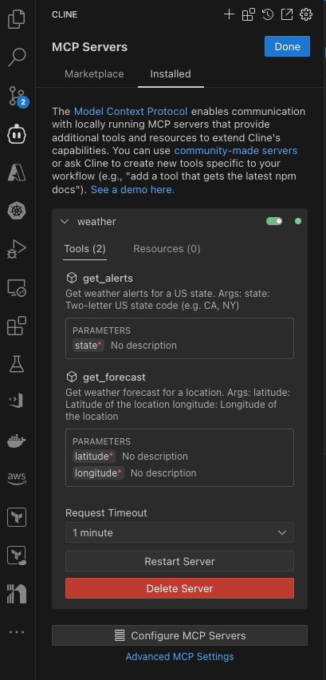
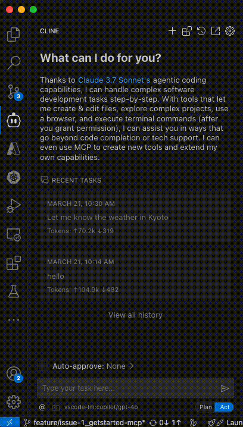

[](https://github.com/ks6088ts-labs/mcp-python/actions/workflows/test.yaml?query=branch%3Amain)
[](https://github.com/ks6088ts-labs/mcp-python/actions/workflows/docker.yaml?query=branch%3Amain)
[](https://github.com/ks6088ts-labs/mcp-python/actions/workflows/docker-release.yaml)
[](https://github.com/ks6088ts-labs/mcp-python/actions/workflows/ghcr-release.yaml)
[](https://github.com/ks6088ts-labs/mcp-python/actions/workflows/github-pages.yaml)

# mcp-python

This is a template repository for Python

## Prerequisites

- [Python 3.10+](https://www.python.org/downloads/)
- [uv](https://docs.astral.sh/uv/getting-started/installation/)
- [GNU Make](https://www.gnu.org/software/make/)

## Examples

### Install MCP Server on Cline

This repository contains a Python implementation of the Model Context Protocol (MCP) server. To install the MCP server, follow these steps:

1. Clone the repository:

```bash
# Clone the repository
git clone https://github.com/ks6088ts-labs/mcp-python.git
cd mcp-python

# Install dependencies
make install-deps-dev

# (Optional) Confirm MCP server is working
# You can run the MCP server locally to test it.
uv run python scripts/weather_server.py
```

2. Install the MCP server on Cline:

To install the MCP server on Cline, you need to create a configuration file like ``/PATH/TO/globalStorage/saoudrizwan.claude-dev/settings/cline_mcp_settings.json` in your Cline user directory. The configuration file should contain the following:

```json
{
  "mcpServers": {
    "weather": {
      "command": "/Users/ks6088ts/.local/bin/uv",
      "args": [
        "--directory",
        "/Users/ks6088ts/src/github.com/ks6088ts-labs/mcp-python/scripts",
        "run",
        "weather_server.py"
      ]
    }
  }
}
```

You can see the settings just like screenshots below:



3. Try it out from Cline:



### Run MCP Client locally

```shell
# Run the MCP server locally
uv run python scripts/weather_server.py

# Run the MCP client locally from another terminal
uv run python scripts/client.py
```

Here is an example of the output you should see:

**client**

```shell
❯ uv run python scripts/client.py
DEBUG:asyncio:Using selector: KqueueSelector
DEBUG:mcp.server.lowlevel.server:Initializing server 'math'
DEBUG:mcp.server.lowlevel.server:Registering handler for ListToolsRequest
DEBUG:mcp.server.lowlevel.server:Registering handler for CallToolRequest
DEBUG:mcp.server.lowlevel.server:Registering handler for ListResourcesRequest
DEBUG:mcp.server.lowlevel.server:Registering handler for ReadResourceRequest
DEBUG:mcp.server.lowlevel.server:Registering handler for PromptListRequest
DEBUG:mcp.server.lowlevel.server:Registering handler for GetPromptRequest
DEBUG:mcp.server.lowlevel.server:Registering handler for ListResourceTemplatesRequest
DEBUG:asyncio:Using selector: KqueueSelector
DEBUG:mcp.server.lowlevel.server:Received message: root=InitializedNotification(method='notifications/initialized', params=None, jsonrpc='2.0')
DEBUG:mcp.server.lowlevel.server:Received message: <mcp.shared.session.RequestResponder object at 0x107e00950>
INFO:mcp.server.lowlevel.server:Processing request of type ListToolsRequest
DEBUG:mcp.server.lowlevel.server:Dispatching request of type ListToolsRequest
DEBUG:mcp.server.lowlevel.server:Response sent
INFO:mcp.client.sse:Connecting to SSE endpoint: http://localhost:8000/sse
DEBUG:httpcore.connection:connect_tcp.started host='localhost' port=8000 local_address=None timeout=5 socket_options=None
DEBUG:httpcore.connection:connect_tcp.complete return_value=<httpcore._backends.anyio.AnyIOStream object at 0x10749c230>
DEBUG:httpcore.http11:send_request_headers.started request=<Request [b'GET']>
DEBUG:httpcore.http11:send_request_headers.complete
DEBUG:httpcore.http11:send_request_body.started request=<Request [b'GET']>
DEBUG:httpcore.http11:send_request_body.complete
DEBUG:httpcore.http11:receive_response_headers.started request=<Request [b'GET']>
DEBUG:httpcore.http11:receive_response_headers.complete return_value=(b'HTTP/1.1', 200, b'OK', [(b'date', b'Fri, 21 Mar 2025 03:20:29 GMT'), (b'server', b'uvicorn'), (b'cache-control', b'no-store'), (b'connection', b'keep-alive'), (b'x-accel-buffering', b'no'), (b'content-type', b'text/event-stream; charset=utf-8'), (b'Transfer-Encoding', b'chunked')])
INFO:httpx:HTTP Request: GET http://localhost:8000/sse "HTTP/1.1 200 OK"
DEBUG:mcp.client.sse:SSE connection established
DEBUG:httpcore.http11:receive_response_body.started request=<Request [b'GET']>
DEBUG:mcp.client.sse:Received SSE event: endpoint
INFO:mcp.client.sse:Received endpoint URL: http://localhost:8000/messages/?session_id=ae67a7911e1848169ecbee39a37f7f71
INFO:mcp.client.sse:Starting post writer with endpoint URL: http://localhost:8000/messages/?session_id=ae67a7911e1848169ecbee39a37f7f71
DEBUG:mcp.client.sse:Sending client message: root=JSONRPCRequest(method='initialize', params={'protocolVersion': '2024-11-05', 'capabilities': {'sampling': {}, 'roots': {'listChanged': True}}, 'clientInfo': {'name': 'mcp', 'version': '0.1.0'}}, jsonrpc='2.0', id=0)
DEBUG:httpcore.connection:connect_tcp.started host='localhost' port=8000 local_address=None timeout=5.0 socket_options=None
DEBUG:httpcore.connection:connect_tcp.complete return_value=<httpcore._backends.anyio.AnyIOStream object at 0x10749d0d0>
DEBUG:httpcore.http11:send_request_headers.started request=<Request [b'POST']>
DEBUG:httpcore.http11:send_request_headers.complete
DEBUG:httpcore.http11:send_request_body.started request=<Request [b'POST']>
DEBUG:httpcore.http11:send_request_body.complete
DEBUG:httpcore.http11:receive_response_headers.started request=<Request [b'POST']>
DEBUG:httpcore.http11:receive_response_headers.complete return_value=(b'HTTP/1.1', 202, b'Accepted', [(b'date', b'Fri, 21 Mar 2025 03:20:29 GMT'), (b'server', b'uvicorn'), (b'content-length', b'8')])
INFO:httpx:HTTP Request: POST http://localhost:8000/messages/?session_id=ae67a7911e1848169ecbee39a37f7f71 "HTTP/1.1 202 Accepted"
DEBUG:httpcore.http11:receive_response_body.started request=<Request [b'POST']>
DEBUG:httpcore.http11:receive_response_body.complete
DEBUG:httpcore.http11:response_closed.started
DEBUG:httpcore.http11:response_closed.complete
DEBUG:mcp.client.sse:Client message sent successfully: 202
DEBUG:mcp.client.sse:Received SSE event: message
DEBUG:mcp.client.sse:Received server message: root=JSONRPCResponse(jsonrpc='2.0', id=0, result={'protocolVersion': '2024-11-05', 'capabilities': {'experimental': {}, 'prompts': {'listChanged': False}, 'resources': {'subscribe': False, 'listChanged': False}, 'tools': {'listChanged': False}}, 'serverInfo': {'name': 'weather', 'version': '1.4.1'}})
DEBUG:mcp.client.sse:Sending client message: root=JSONRPCNotification(method='notifications/initialized', jsonrpc='2.0', params=None)
DEBUG:httpcore.http11:send_request_headers.started request=<Request [b'POST']>
DEBUG:httpcore.http11:send_request_headers.complete
DEBUG:httpcore.http11:send_request_body.started request=<Request [b'POST']>
DEBUG:httpcore.http11:send_request_body.complete
DEBUG:httpcore.http11:receive_response_headers.started request=<Request [b'POST']>
DEBUG:httpcore.http11:receive_response_headers.complete return_value=(b'HTTP/1.1', 202, b'Accepted', [(b'date', b'Fri, 21 Mar 2025 03:20:29 GMT'), (b'server', b'uvicorn'), (b'content-length', b'8')])
INFO:httpx:HTTP Request: POST http://localhost:8000/messages/?session_id=ae67a7911e1848169ecbee39a37f7f71 "HTTP/1.1 202 Accepted"
DEBUG:httpcore.http11:receive_response_body.started request=<Request [b'POST']>
DEBUG:httpcore.http11:receive_response_body.complete
DEBUG:httpcore.http11:response_closed.started
DEBUG:httpcore.http11:response_closed.complete
DEBUG:mcp.client.sse:Client message sent successfully: 202
DEBUG:mcp.client.sse:Sending client message: root=JSONRPCRequest(method='tools/list', params=None, jsonrpc='2.0', id=1)
DEBUG:httpcore.http11:send_request_headers.started request=<Request [b'POST']>
DEBUG:httpcore.http11:send_request_headers.complete
DEBUG:httpcore.http11:send_request_body.started request=<Request [b'POST']>
DEBUG:httpcore.http11:send_request_body.complete
DEBUG:httpcore.http11:receive_response_headers.started request=<Request [b'POST']>
DEBUG:httpcore.http11:receive_response_headers.complete return_value=(b'HTTP/1.1', 202, b'Accepted', [(b'date', b'Fri, 21 Mar 2025 03:20:29 GMT'), (b'server', b'uvicorn'), (b'content-length', b'8')])
INFO:httpx:HTTP Request: POST http://localhost:8000/messages/?session_id=ae67a7911e1848169ecbee39a37f7f71 "HTTP/1.1 202 Accepted"
DEBUG:httpcore.http11:receive_response_body.started request=<Request [b'POST']>
DEBUG:httpcore.http11:receive_response_body.complete
DEBUG:httpcore.http11:response_closed.started
DEBUG:httpcore.http11:response_closed.complete
DEBUG:mcp.client.sse:Client message sent successfully: 202
DEBUG:mcp.client.sse:Received SSE event: message
DEBUG:mcp.client.sse:Received server message: root=JSONRPCResponse(jsonrpc='2.0', id=1, result={'tools': [{'name': 'get_alerts', 'description': 'Get weather alerts for a US state.\n\n    Args:\n        state: Two-letter US state code (e.g. CA, NY)\n    ', 'inputSchema': {'properties': {'state': {'title': 'State', 'type': 'string'}}, 'required': ['state'], 'title': 'get_alertsArguments', 'type': 'object'}}, {'name': 'get_forecast', 'description': 'Get weather forecast for a location.\n\n    Args:\n        latitude: Latitude of the location\n        longitude: Longitude of the location\n    ', 'inputSchema': {'properties': {'latitude': {'title': 'Latitude', 'type': 'number'}, 'longitude': {'title': 'Longitude', 'type': 'number'}}, 'required': ['latitude', 'longitude'], 'title': 'get_forecastArguments', 'type': 'object'}}]})
DEBUG:openai._base_client:Request options: {'method': 'post', 'url': '/deployments/gpt-4o/chat/completions', 'headers': {'api-key': '<redacted>'}, 'files': None, 'json_data': {'messages': [{'content': 'what is 1 + 1?', 'role': 'user'}], 'model': 'gpt-4o', 'stream': False, 'tools': [{'type': 'function', 'function': {'name': 'add', 'description': 'Add two numbers', 'parameters': {'properties': {'a': {'type': 'integer'}, 'b': {'type': 'integer'}}, 'required': ['a', 'b'], 'type': 'object'}}}, {'type': 'function', 'function': {'name': 'multiply', 'description': 'Multiply two numbers', 'parameters': {'properties': {'a': {'type': 'integer'}, 'b': {'type': 'integer'}}, 'required': ['a', 'b'], 'type': 'object'}}}, {'type': 'function', 'function': {'name': 'get_alerts', 'description': 'Get weather alerts for a US state.\n\n    Args:\n        state: Two-letter US state code (e.g. CA, NY)\n    ', 'parameters': {'properties': {'state': {'type': 'string'}}, 'required': ['state'], 'type': 'object'}}}, {'type': 'function', 'function': {'name': 'get_forecast', 'description': 'Get weather forecast for a location.\n\n    Args:\n        latitude: Latitude of the location\n        longitude: Longitude of the location\n    ', 'parameters': {'properties': {'latitude': {'type': 'number'}, 'longitude': {'type': 'number'}}, 'required': ['latitude', 'longitude'], 'type': 'object'}}}]}}
DEBUG:httpcore.connection:connect_tcp.started host='aoaiplaygroundsnih8leastus.openai.azure.com' port=443 local_address=None timeout=None socket_options=None
DEBUG:httpcore.connection:connect_tcp.complete return_value=<httpcore._backends.anyio.AnyIOStream object at 0x10dd62270>
DEBUG:httpcore.connection:start_tls.started ssl_context=<ssl.SSLContext object at 0x10749bed0> server_hostname='aoaiplaygroundsnih8leastus.openai.azure.com' timeout=None
DEBUG:httpcore.connection:start_tls.complete return_value=<httpcore._backends.anyio.AnyIOStream object at 0x10dd39ee0>
DEBUG:httpcore.http11:send_request_headers.started request=<Request [b'POST']>
DEBUG:httpcore.http11:send_request_headers.complete
DEBUG:httpcore.http11:send_request_body.started request=<Request [b'POST']>
DEBUG:httpcore.http11:send_request_body.complete
DEBUG:httpcore.http11:receive_response_headers.started request=<Request [b'POST']>
DEBUG:httpcore.http11:receive_response_headers.complete return_value=(b'HTTP/1.1', 200, b'OK', [(b'Content-Length', b'1019'), (b'Content-Type', b'application/json'), (b'apim-request-id', b'6c4f1b4e-5806-4057-bcf7-6e731f2056b1'), (b'Strict-Transport-Security', b'max-age=31536000; includeSubDomains; preload'), (b'x-content-type-options', b'nosniff'), (b'x-ms-region', b'East US'), (b'x-ratelimit-remaining-requests', b'449'), (b'x-ratelimit-limit-requests', b'450'), (b'x-ratelimit-remaining-tokens', b'449356'), (b'x-ratelimit-limit-tokens', b'450000'), (b'cmp-upstream-response-duration', b'516'), (b'x-accel-buffering', b'no'), (b'x-aml-cluster', b'hyena-japaneast-02'), (b'x-envoy-upstream-service-time', b'552'), (b'x-ms-rai-invoked', b'true'), (b'x-request-id', b'f419ec8f-0b2e-40af-9188-0d0df23d7628'), (b'ms-azureml-model-time', b'549'), (b'x-ms-client-request-id', b'6c4f1b4e-5806-4057-bcf7-6e731f2056b1'), (b'azureml-model-session', b'v20250319-1-164616836'), (b'Date', b'Fri, 21 Mar 2025 03:20:30 GMT')])
INFO:httpx:HTTP Request: POST https://aoaiplaygroundsnih8leastus.openai.azure.com/openai/deployments/gpt-4o/chat/completions?api-version=2024-10-21 "HTTP/1.1 200 OK"
DEBUG:httpcore.http11:receive_response_body.started request=<Request [b'POST']>
DEBUG:httpcore.http11:receive_response_body.complete
DEBUG:httpcore.http11:response_closed.started
DEBUG:httpcore.http11:response_closed.complete
DEBUG:openai._base_client:HTTP Request: POST https://aoaiplaygroundsnih8leastus.openai.azure.com/openai/deployments/gpt-4o/chat/completions?api-version=2024-10-21 "200 OK"
DEBUG:mcp.server.lowlevel.server:Received message: <mcp.shared.session.RequestResponder object at 0x105ebecc0>
INFO:mcp.server.lowlevel.server:Processing request of type CallToolRequest
DEBUG:mcp.server.lowlevel.server:Dispatching request of type CallToolRequest
DEBUG:mcp.server.lowlevel.server:Response sent
DEBUG:openai._base_client:Request options: {'method': 'post', 'url': '/deployments/gpt-4o/chat/completions', 'headers': {'api-key': '<redacted>'}, 'files': None, 'json_data': {'messages': [{'content': 'what is 1 + 1?', 'role': 'user'}, {'content': None, 'role': 'assistant', 'tool_calls': [{'type': 'function', 'id': 'call_3BW3niijGwoaHOrxo10KVyL0', 'function': {'name': 'add', 'arguments': '{"a": 1, "b": 1}'}}]}, {'content': '2', 'role': 'tool', 'tool_call_id': 'call_3BW3niijGwoaHOrxo10KVyL0'}], 'model': 'gpt-4o', 'stream': False, 'tools': [{'type': 'function', 'function': {'name': 'add', 'description': 'Add two numbers', 'parameters': {'properties': {'a': {'type': 'integer'}, 'b': {'type': 'integer'}}, 'required': ['a', 'b'], 'type': 'object'}}}, {'type': 'function', 'function': {'name': 'multiply', 'description': 'Multiply two numbers', 'parameters': {'properties': {'a': {'type': 'integer'}, 'b': {'type': 'integer'}}, 'required': ['a', 'b'], 'type': 'object'}}}, {'type': 'function', 'function': {'name': 'get_alerts', 'description': 'Get weather alerts for a US state.\n\n    Args:\n        state: Two-letter US state code (e.g. CA, NY)\n    ', 'parameters': {'properties': {'state': {'type': 'string'}}, 'required': ['state'], 'type': 'object'}}}, {'type': 'function', 'function': {'name': 'get_forecast', 'description': 'Get weather forecast for a location.\n\n    Args:\n        latitude: Latitude of the location\n        longitude: Longitude of the location\n    ', 'parameters': {'properties': {'latitude': {'type': 'number'}, 'longitude': {'type': 'number'}}, 'required': ['latitude', 'longitude'], 'type': 'object'}}}]}}
DEBUG:httpcore.http11:send_request_headers.started request=<Request [b'POST']>
DEBUG:httpcore.http11:send_request_headers.complete
DEBUG:httpcore.http11:send_request_body.started request=<Request [b'POST']>
DEBUG:httpcore.http11:send_request_body.complete
DEBUG:httpcore.http11:receive_response_headers.started request=<Request [b'POST']>
DEBUG:httpcore.http11:receive_response_headers.complete return_value=(b'HTTP/1.1', 200, b'OK', [(b'Content-Length', b'1206'), (b'Content-Type', b'application/json'), (b'apim-request-id', b'236e15c1-2af1-4403-9d01-988e2efa7a5a'), (b'Strict-Transport-Security', b'max-age=31536000; includeSubDomains; preload'), (b'x-content-type-options', b'nosniff'), (b'x-ms-region', b'East US'), (b'x-ratelimit-remaining-requests', b'448'), (b'x-ratelimit-limit-requests', b'450'), (b'x-ratelimit-remaining-tokens', b'448711'), (b'x-ratelimit-limit-tokens', b'450000'), (b'cmp-upstream-response-duration', b'317'), (b'x-accel-buffering', b'no'), (b'x-aml-cluster', b'hyena-japaneast-01'), (b'x-envoy-upstream-service-time', b'363'), (b'x-ms-rai-invoked', b'true'), (b'x-request-id', b'bf76a3ef-0d77-4534-8fa3-59c85882924e'), (b'ms-azureml-model-time', b'360'), (b'x-ms-client-request-id', b'236e15c1-2af1-4403-9d01-988e2efa7a5a'), (b'azureml-model-session', b'v20250319-1-164616836'), (b'Date', b'Fri, 21 Mar 2025 03:20:31 GMT')])
INFO:httpx:HTTP Request: POST https://aoaiplaygroundsnih8leastus.openai.azure.com/openai/deployments/gpt-4o/chat/completions?api-version=2024-10-21 "HTTP/1.1 200 OK"
DEBUG:httpcore.http11:receive_response_body.started request=<Request [b'POST']>
DEBUG:httpcore.http11:receive_response_body.complete
DEBUG:httpcore.http11:response_closed.started
DEBUG:httpcore.http11:response_closed.complete
DEBUG:openai._base_client:HTTP Request: POST https://aoaiplaygroundsnih8leastus.openai.azure.com/openai/deployments/gpt-4o/chat/completions?api-version=2024-10-21 "200 OK"
DEBUG:httpcore.http11:response_closed.started
DEBUG:httpcore.http11:receive_response_body.failed exception=CancelledError('Cancelled by cancel scope 1073fc080')
DEBUG:httpcore.http11:response_closed.complete
DEBUG:httpcore.connection:close.started
DEBUG:httpcore.connection:close.complete
Result: {'messages': [HumanMessage(content='what is 1 + 1?', additional_kwargs={}, response_metadata={}, id='80399d00-a691-4ce8-9a66-5d2b625dc929'), AIMessage(content='', additional_kwargs={'tool_calls': [{'id': 'call_3BW3niijGwoaHOrxo10KVyL0', 'function': {'arguments': '{"a":1,"b":1}', 'name': 'add'}, 'type': 'function'}], 'refusal': None}, response_metadata={'token_usage': {'completion_tokens': 18, 'prompt_tokens': 156, 'total_tokens': 174, 'completion_tokens_details': {'accepted_prediction_tokens': 0, 'audio_tokens': 0, 'reasoning_tokens': 0, 'rejected_prediction_tokens': 0}, 'prompt_tokens_details': {'audio_tokens': 0, 'cached_tokens': 0}}, 'model_name': 'gpt-4o-2024-11-20', 'system_fingerprint': 'fp_a42ed5ff0c', 'id': 'chatcmpl-BDNDqTmDZkczRIs547jNaWyju3RPM', 'prompt_filter_results': [{'prompt_index': 0, 'content_filter_results': {'hate': {'filtered': False, 'severity': 'safe'}, 'jailbreak': {'filtered': False, 'detected': False}, 'self_harm': {'filtered': False, 'severity': 'safe'}, 'sexual': {'filtered': False, 'severity': 'safe'}, 'violence': {'filtered': False, 'severity': 'safe'}}}], 'finish_reason': 'tool_calls', 'logprobs': None, 'content_filter_results': {}}, id='run-160d044d-fb7e-4f6d-86a1-3f90c38fa2c3-0', tool_calls=[{'name': 'add', 'args': {'a': 1, 'b': 1}, 'id': 'call_3BW3niijGwoaHOrxo10KVyL0', 'type': 'tool_call'}], usage_metadata={'input_tokens': 156, 'output_tokens': 18, 'total_tokens': 174, 'input_token_details': {'audio': 0, 'cache_read': 0}, 'output_token_details': {'audio': 0, 'reasoning': 0}}), ToolMessage(content='2', name='add', id='c15c41d4-4568-42e6-a9d6-d5b472daa1bf', tool_call_id='call_3BW3niijGwoaHOrxo10KVyL0'), AIMessage(content='1 + 1 equals 2.', additional_kwargs={'refusal': None}, response_metadata={'token_usage': {'completion_tokens': 10, 'prompt_tokens': 181, 'total_tokens': 191, 'completion_tokens_details': {'accepted_prediction_tokens': 0, 'audio_tokens': 0, 'reasoning_tokens': 0, 'rejected_prediction_tokens': 0}, 'prompt_tokens_details': {'audio_tokens': 0, 'cached_tokens': 0}}, 'model_name': 'gpt-4o-2024-11-20', 'system_fingerprint': 'fp_b705f0c291', 'id': 'chatcmpl-BDNDr9ALAAu58OfVuu3KPvFhGAC65', 'prompt_filter_results': [{'prompt_index': 0, 'content_filter_results': {'hate': {'filtered': False, 'severity': 'safe'}, 'jailbreak': {'filtered': False, 'detected': False}, 'self_harm': {'filtered': False, 'severity': 'safe'}, 'sexual': {'filtered': False, 'severity': 'safe'}, 'violence': {'filtered': False, 'severity': 'safe'}}}], 'finish_reason': 'stop', 'logprobs': None, 'content_filter_results': {'hate': {'filtered': False, 'severity': 'safe'}, 'protected_material_code': {'filtered': False, 'detected': False}, 'protected_material_text': {'filtered': False, 'detected': False}, 'self_harm': {'filtered': False, 'severity': 'safe'}, 'sexual': {'filtered': False, 'severity': 'safe'}, 'violence': {'filtered': False, 'severity': 'safe'}}}, id='run-0714f485-2127-4c33-bc00-c783a45624a8-0', usage_metadata={'input_tokens': 181, 'output_tokens': 10, 'total_tokens': 191, 'input_token_details': {'audio': 0, 'cache_read': 0}, 'output_token_details': {'audio': 0, 'reasoning': 0}})]}
Question: what is 1 + 1?
Answer: 1 + 1 equals 2.
DEBUG:asyncio:Using selector: KqueueSelector
DEBUG:mcp.server.lowlevel.server:Initializing server 'math'
DEBUG:mcp.server.lowlevel.server:Registering handler for ListToolsRequest
DEBUG:mcp.server.lowlevel.server:Registering handler for CallToolRequest
DEBUG:mcp.server.lowlevel.server:Registering handler for ListResourcesRequest
DEBUG:mcp.server.lowlevel.server:Registering handler for ReadResourceRequest
DEBUG:mcp.server.lowlevel.server:Registering handler for PromptListRequest
DEBUG:mcp.server.lowlevel.server:Registering handler for GetPromptRequest
DEBUG:mcp.server.lowlevel.server:Registering handler for ListResourceTemplatesRequest
DEBUG:asyncio:Using selector: KqueueSelector
DEBUG:mcp.server.lowlevel.server:Received message: root=InitializedNotification(method='notifications/initialized', params=None, jsonrpc='2.0')
DEBUG:mcp.server.lowlevel.server:Received message: <mcp.shared.session.RequestResponder object at 0x103de6cc0>
INFO:mcp.server.lowlevel.server:Processing request of type ListToolsRequest
DEBUG:mcp.server.lowlevel.server:Dispatching request of type ListToolsRequest
DEBUG:mcp.server.lowlevel.server:Response sent
INFO:mcp.client.sse:Connecting to SSE endpoint: http://localhost:8000/sse
DEBUG:httpcore.connection:connect_tcp.started host='localhost' port=8000 local_address=None timeout=5 socket_options=None
DEBUG:httpcore.connection:connect_tcp.complete return_value=<httpcore._backends.anyio.AnyIOStream object at 0x10dd61d30>
DEBUG:httpcore.http11:send_request_headers.started request=<Request [b'GET']>
DEBUG:httpcore.http11:send_request_headers.complete
DEBUG:httpcore.http11:send_request_body.started request=<Request [b'GET']>
DEBUG:httpcore.http11:send_request_body.complete
DEBUG:httpcore.http11:receive_response_headers.started request=<Request [b'GET']>
DEBUG:httpcore.http11:receive_response_headers.complete return_value=(b'HTTP/1.1', 200, b'OK', [(b'date', b'Fri, 21 Mar 2025 03:20:31 GMT'), (b'server', b'uvicorn'), (b'cache-control', b'no-store'), (b'connection', b'keep-alive'), (b'x-accel-buffering', b'no'), (b'content-type', b'text/event-stream; charset=utf-8'), (b'Transfer-Encoding', b'chunked')])
INFO:httpx:HTTP Request: GET http://localhost:8000/sse "HTTP/1.1 200 OK"
DEBUG:mcp.client.sse:SSE connection established
DEBUG:httpcore.http11:receive_response_body.started request=<Request [b'GET']>
DEBUG:mcp.client.sse:Received SSE event: endpoint
INFO:mcp.client.sse:Received endpoint URL: http://localhost:8000/messages/?session_id=d85f8840fc38474f9e40eb2eef76d755
INFO:mcp.client.sse:Starting post writer with endpoint URL: http://localhost:8000/messages/?session_id=d85f8840fc38474f9e40eb2eef76d755
DEBUG:mcp.client.sse:Sending client message: root=JSONRPCRequest(method='initialize', params={'protocolVersion': '2024-11-05', 'capabilities': {'sampling': {}, 'roots': {'listChanged': True}}, 'clientInfo': {'name': 'mcp', 'version': '0.1.0'}}, jsonrpc='2.0', id=0)
DEBUG:httpcore.connection:connect_tcp.started host='localhost' port=8000 local_address=None timeout=5.0 socket_options=None
DEBUG:httpcore.connection:connect_tcp.complete return_value=<httpcore._backends.anyio.AnyIOStream object at 0x1074eae70>
DEBUG:httpcore.http11:send_request_headers.started request=<Request [b'POST']>
DEBUG:httpcore.http11:send_request_headers.complete
DEBUG:httpcore.http11:send_request_body.started request=<Request [b'POST']>
DEBUG:httpcore.http11:send_request_body.complete
DEBUG:httpcore.http11:receive_response_headers.started request=<Request [b'POST']>
DEBUG:httpcore.http11:receive_response_headers.complete return_value=(b'HTTP/1.1', 202, b'Accepted', [(b'date', b'Fri, 21 Mar 2025 03:20:31 GMT'), (b'server', b'uvicorn'), (b'content-length', b'8')])
INFO:httpx:HTTP Request: POST http://localhost:8000/messages/?session_id=d85f8840fc38474f9e40eb2eef76d755 "HTTP/1.1 202 Accepted"
DEBUG:httpcore.http11:receive_response_body.started request=<Request [b'POST']>
DEBUG:httpcore.http11:receive_response_body.complete
DEBUG:httpcore.http11:response_closed.started
DEBUG:httpcore.http11:response_closed.complete
DEBUG:mcp.client.sse:Client message sent successfully: 202
DEBUG:mcp.client.sse:Received SSE event: message
DEBUG:mcp.client.sse:Received server message: root=JSONRPCResponse(jsonrpc='2.0', id=0, result={'protocolVersion': '2024-11-05', 'capabilities': {'experimental': {}, 'prompts': {'listChanged': False}, 'resources': {'subscribe': False, 'listChanged': False}, 'tools': {'listChanged': False}}, 'serverInfo': {'name': 'weather', 'version': '1.4.1'}})
DEBUG:mcp.client.sse:Sending client message: root=JSONRPCNotification(method='notifications/initialized', jsonrpc='2.0', params=None)
DEBUG:httpcore.http11:send_request_headers.started request=<Request [b'POST']>
DEBUG:httpcore.http11:send_request_headers.complete
DEBUG:httpcore.http11:send_request_body.started request=<Request [b'POST']>
DEBUG:httpcore.http11:send_request_body.complete
DEBUG:httpcore.http11:receive_response_headers.started request=<Request [b'POST']>
DEBUG:httpcore.http11:receive_response_headers.complete return_value=(b'HTTP/1.1', 202, b'Accepted', [(b'date', b'Fri, 21 Mar 2025 03:20:31 GMT'), (b'server', b'uvicorn'), (b'content-length', b'8')])
INFO:httpx:HTTP Request: POST http://localhost:8000/messages/?session_id=d85f8840fc38474f9e40eb2eef76d755 "HTTP/1.1 202 Accepted"
DEBUG:httpcore.http11:receive_response_body.started request=<Request [b'POST']>
DEBUG:httpcore.http11:receive_response_body.complete
DEBUG:httpcore.http11:response_closed.started
DEBUG:httpcore.http11:response_closed.complete
DEBUG:mcp.client.sse:Client message sent successfully: 202
DEBUG:mcp.client.sse:Sending client message: root=JSONRPCRequest(method='tools/list', params=None, jsonrpc='2.0', id=1)
DEBUG:httpcore.http11:send_request_headers.started request=<Request [b'POST']>
DEBUG:httpcore.http11:send_request_headers.complete
DEBUG:httpcore.http11:send_request_body.started request=<Request [b'POST']>
DEBUG:httpcore.http11:send_request_body.complete
DEBUG:httpcore.http11:receive_response_headers.started request=<Request [b'POST']>
DEBUG:httpcore.http11:receive_response_headers.complete return_value=(b'HTTP/1.1', 202, b'Accepted', [(b'date', b'Fri, 21 Mar 2025 03:20:31 GMT'), (b'server', b'uvicorn'), (b'content-length', b'8')])
INFO:httpx:HTTP Request: POST http://localhost:8000/messages/?session_id=d85f8840fc38474f9e40eb2eef76d755 "HTTP/1.1 202 Accepted"
DEBUG:httpcore.http11:receive_response_body.started request=<Request [b'POST']>
DEBUG:httpcore.http11:receive_response_body.complete
DEBUG:httpcore.http11:response_closed.started
DEBUG:httpcore.http11:response_closed.complete
DEBUG:mcp.client.sse:Client message sent successfully: 202
DEBUG:mcp.client.sse:Received SSE event: message
DEBUG:mcp.client.sse:Received server message: root=JSONRPCResponse(jsonrpc='2.0', id=1, result={'tools': [{'name': 'get_alerts', 'description': 'Get weather alerts for a US state.\n\n    Args:\n        state: Two-letter US state code (e.g. CA, NY)\n    ', 'inputSchema': {'properties': {'state': {'title': 'State', 'type': 'string'}}, 'required': ['state'], 'title': 'get_alertsArguments', 'type': 'object'}}, {'name': 'get_forecast', 'description': 'Get weather forecast for a location.\n\n    Args:\n        latitude: Latitude of the location\n        longitude: Longitude of the location\n    ', 'inputSchema': {'properties': {'latitude': {'title': 'Latitude', 'type': 'number'}, 'longitude': {'title': 'Longitude', 'type': 'number'}}, 'required': ['latitude', 'longitude'], 'title': 'get_forecastArguments', 'type': 'object'}}]})
DEBUG:openai._base_client:Request options: {'method': 'post', 'url': '/deployments/gpt-4o/chat/completions', 'headers': {'api-key': '<redacted>'}, 'files': None, 'json_data': {'messages': [{'content': 'what is the weather in nyc?', 'role': 'user'}], 'model': 'gpt-4o', 'stream': False, 'tools': [{'type': 'function', 'function': {'name': 'add', 'description': 'Add two numbers', 'parameters': {'properties': {'a': {'type': 'integer'}, 'b': {'type': 'integer'}}, 'required': ['a', 'b'], 'type': 'object'}}}, {'type': 'function', 'function': {'name': 'multiply', 'description': 'Multiply two numbers', 'parameters': {'properties': {'a': {'type': 'integer'}, 'b': {'type': 'integer'}}, 'required': ['a', 'b'], 'type': 'object'}}}, {'type': 'function', 'function': {'name': 'get_alerts', 'description': 'Get weather alerts for a US state.\n\n    Args:\n        state: Two-letter US state code (e.g. CA, NY)\n    ', 'parameters': {'properties': {'state': {'type': 'string'}}, 'required': ['state'], 'type': 'object'}}}, {'type': 'function', 'function': {'name': 'get_forecast', 'description': 'Get weather forecast for a location.\n\n    Args:\n        latitude: Latitude of the location\n        longitude: Longitude of the location\n    ', 'parameters': {'properties': {'latitude': {'type': 'number'}, 'longitude': {'type': 'number'}}, 'required': ['latitude', 'longitude'], 'type': 'object'}}}]}}
DEBUG:httpcore.connection:connect_tcp.started host='aoaiplaygroundsnih8leastus.openai.azure.com' port=443 local_address=None timeout=None socket_options=None
DEBUG:httpcore.connection:connect_tcp.complete return_value=<httpcore._backends.anyio.AnyIOStream object at 0x10df1f350>
DEBUG:httpcore.connection:start_tls.started ssl_context=<ssl.SSLContext object at 0x10dddbc50> server_hostname='aoaiplaygroundsnih8leastus.openai.azure.com' timeout=None
DEBUG:httpcore.connection:start_tls.complete return_value=<httpcore._backends.anyio.AnyIOStream object at 0x10df1efc0>
DEBUG:httpcore.http11:send_request_headers.started request=<Request [b'POST']>
DEBUG:httpcore.http11:send_request_headers.complete
DEBUG:httpcore.http11:send_request_body.started request=<Request [b'POST']>
DEBUG:httpcore.http11:send_request_body.complete
DEBUG:httpcore.http11:receive_response_headers.started request=<Request [b'POST']>
DEBUG:httpcore.http11:receive_response_headers.complete return_value=(b'HTTP/1.1', 200, b'OK', [(b'Content-Length', b'1055'), (b'Content-Type', b'application/json'), (b'apim-request-id', b'92862cd0-9059-4e57-ba76-e22affdfe727'), (b'Strict-Transport-Security', b'max-age=31536000; includeSubDomains; preload'), (b'x-content-type-options', b'nosniff'), (b'x-ms-region', b'East US'), (b'x-ratelimit-remaining-requests', b'447'), (b'x-ratelimit-limit-requests', b'450'), (b'x-ratelimit-remaining-tokens', b'448064'), (b'x-ratelimit-limit-tokens', b'450000'), (b'cmp-upstream-response-duration', b'526'), (b'x-accel-buffering', b'no'), (b'x-aml-cluster', b'hyena-japaneast-02'), (b'x-envoy-upstream-service-time', b'561'), (b'x-ms-rai-invoked', b'true'), (b'x-request-id', b'3cfb4d2e-b9a0-46b4-a101-17dea61ca389'), (b'ms-azureml-model-time', b'559'), (b'x-ms-client-request-id', b'92862cd0-9059-4e57-ba76-e22affdfe727'), (b'azureml-model-session', b'v20250319-1-164616836'), (b'Date', b'Fri, 21 Mar 2025 03:20:34 GMT')])
INFO:httpx:HTTP Request: POST https://aoaiplaygroundsnih8leastus.openai.azure.com/openai/deployments/gpt-4o/chat/completions?api-version=2024-10-21 "HTTP/1.1 200 OK"
DEBUG:httpcore.http11:receive_response_body.started request=<Request [b'POST']>
DEBUG:httpcore.http11:receive_response_body.complete
DEBUG:httpcore.http11:response_closed.started
DEBUG:httpcore.http11:response_closed.complete
DEBUG:openai._base_client:HTTP Request: POST https://aoaiplaygroundsnih8leastus.openai.azure.com/openai/deployments/gpt-4o/chat/completions?api-version=2024-10-21 "200 OK"
DEBUG:mcp.client.sse:Sending client message: root=JSONRPCRequest(method='tools/call', params={'name': 'get_forecast', 'arguments': {'latitude': 40.7128, 'longitude': -74.006}}, jsonrpc='2.0', id=2)
DEBUG:httpcore.http11:send_request_headers.started request=<Request [b'POST']>
DEBUG:httpcore.http11:send_request_headers.complete
DEBUG:httpcore.http11:send_request_body.started request=<Request [b'POST']>
DEBUG:httpcore.http11:send_request_body.complete
DEBUG:httpcore.http11:receive_response_headers.started request=<Request [b'POST']>
DEBUG:httpcore.http11:receive_response_headers.complete return_value=(b'HTTP/1.1', 202, b'Accepted', [(b'date', b'Fri, 21 Mar 2025 03:20:33 GMT'), (b'server', b'uvicorn'), (b'content-length', b'8')])
INFO:httpx:HTTP Request: POST http://localhost:8000/messages/?session_id=d85f8840fc38474f9e40eb2eef76d755 "HTTP/1.1 202 Accepted"
DEBUG:httpcore.http11:receive_response_body.started request=<Request [b'POST']>
DEBUG:httpcore.http11:receive_response_body.complete
DEBUG:httpcore.http11:response_closed.started
DEBUG:httpcore.http11:response_closed.complete
DEBUG:mcp.client.sse:Client message sent successfully: 202
DEBUG:mcp.client.sse:Received SSE event: message
DEBUG:mcp.client.sse:Received server message: root=JSONRPCResponse(jsonrpc='2.0', id=2, result={'content': [{'type': 'text', 'text': '\nTonight:\nTemperature: 41°F\nWind: 6 to 22 mph NW\nForecast: Rain showers before midnight, then rain showers and patchy fog. Cloudy. Low around 41, with temperatures rising to around 43 overnight. Northwest wind 6 to 22 mph. Chance of precipitation is 100%. New rainfall amounts between a half and three quarters of an inch possible.\n\n---\n\nFriday:\nTemperature: 54°F\nWind: 22 to 26 mph NW\nForecast: Mostly sunny, with a high near 54. Northwest wind 22 to 26 mph, with gusts as high as 39 mph.\n\n---\n\nFriday Night:\nTemperature: 41°F\nWind: 6 to 20 mph W\nForecast: Mostly clear, with a low around 41. West wind 6 to 20 mph, with gusts as high as 30 mph.\n\n---\n\nSaturday:\nTemperature: 57°F\nWind: 7 to 16 mph SW\nForecast: Partly sunny, with a high near 57. Southwest wind 7 to 16 mph.\n\n---\n\nSaturday Night:\nTemperature: 34°F\nWind: 16 mph W\nForecast: Mostly clear, with a low around 34. West wind around 16 mph.\n'}], 'isError': False})
DEBUG:openai._base_client:Request options: {'method': 'post', 'url': '/deployments/gpt-4o/chat/completions', 'headers': {'api-key': '<redacted>'}, 'files': None, 'json_data': {'messages': [{'content': 'what is the weather in nyc?', 'role': 'user'}, {'content': None, 'role': 'assistant', 'tool_calls': [{'type': 'function', 'id': 'call_TZLJJH2BcMLE7qqXeCEQjS2c', 'function': {'name': 'get_forecast', 'arguments': '{"latitude": 40.7128, "longitude": -74.006}'}}]}, {'content': '\nTonight:\nTemperature: 41°F\nWind: 6 to 22 mph NW\nForecast: Rain showers before midnight, then rain showers and patchy fog. Cloudy. Low around 41, with temperatures rising to around 43 overnight. Northwest wind 6 to 22 mph. Chance of precipitation is 100%. New rainfall amounts between a half and three quarters of an inch possible.\n\n---\n\nFriday:\nTemperature: 54°F\nWind: 22 to 26 mph NW\nForecast: Mostly sunny, with a high near 54. Northwest wind 22 to 26 mph, with gusts as high as 39 mph.\n\n---\n\nFriday Night:\nTemperature: 41°F\nWind: 6 to 20 mph W\nForecast: Mostly clear, with a low around 41. West wind 6 to 20 mph, with gusts as high as 30 mph.\n\n---\n\nSaturday:\nTemperature: 57°F\nWind: 7 to 16 mph SW\nForecast: Partly sunny, with a high near 57. Southwest wind 7 to 16 mph.\n\n---\n\nSaturday Night:\nTemperature: 34°F\nWind: 16 mph W\nForecast: Mostly clear, with a low around 34. West wind around 16 mph.\n', 'role': 'tool', 'tool_call_id': 'call_TZLJJH2BcMLE7qqXeCEQjS2c'}], 'model': 'gpt-4o', 'stream': False, 'tools': [{'type': 'function', 'function': {'name': 'add', 'description': 'Add two numbers', 'parameters': {'properties': {'a': {'type': 'integer'}, 'b': {'type': 'integer'}}, 'required': ['a', 'b'], 'type': 'object'}}}, {'type': 'function', 'function': {'name': 'multiply', 'description': 'Multiply two numbers', 'parameters': {'properties': {'a': {'type': 'integer'}, 'b': {'type': 'integer'}}, 'required': ['a', 'b'], 'type': 'object'}}}, {'type': 'function', 'function': {'name': 'get_alerts', 'description': 'Get weather alerts for a US state.\n\n    Args:\n        state: Two-letter US state code (e.g. CA, NY)\n    ', 'parameters': {'properties': {'state': {'type': 'string'}}, 'required': ['state'], 'type': 'object'}}}, {'type': 'function', 'function': {'name': 'get_forecast', 'description': 'Get weather forecast for a location.\n\n    Args:\n        latitude: Latitude of the location\n        longitude: Longitude of the location\n    ', 'parameters': {'properties': {'latitude': {'type': 'number'}, 'longitude': {'type': 'number'}}, 'required': ['latitude', 'longitude'], 'type': 'object'}}}]}}
DEBUG:httpcore.http11:send_request_headers.started request=<Request [b'POST']>
DEBUG:httpcore.http11:send_request_headers.complete
DEBUG:httpcore.http11:send_request_body.started request=<Request [b'POST']>
DEBUG:httpcore.http11:send_request_body.complete
DEBUG:httpcore.http11:receive_response_headers.started request=<Request [b'POST']>
DEBUG:httpcore.http11:receive_response_headers.complete return_value=(b'HTTP/1.1', 200, b'OK', [(b'Content-Length', b'1980'), (b'Content-Type', b'application/json'), (b'apim-request-id', b'e4ad8c95-c3b2-4188-82fd-5849a2c8fb5b'), (b'Strict-Transport-Security', b'max-age=31536000; includeSubDomains; preload'), (b'x-content-type-options', b'nosniff'), (b'x-ms-region', b'East US'), (b'x-ratelimit-remaining-requests', b'446'), (b'x-ratelimit-limit-requests', b'450'), (b'x-ratelimit-remaining-tokens', b'447191'), (b'x-ratelimit-limit-tokens', b'450000'), (b'cmp-upstream-response-duration', b'3590'), (b'x-accel-buffering', b'no'), (b'x-aml-cluster', b'hyena-japaneast-02'), (b'x-envoy-upstream-service-time', b'3683'), (b'x-ms-rai-invoked', b'true'), (b'x-request-id', b'28e3ad6b-e5ff-4d08-8d69-3db15db389b1'), (b'ms-azureml-model-time', b'3681'), (b'x-ms-client-request-id', b'e4ad8c95-c3b2-4188-82fd-5849a2c8fb5b'), (b'azureml-model-session', b'v20250319-1-164616836'), (b'Date', b'Fri, 21 Mar 2025 03:20:38 GMT')])
INFO:httpx:HTTP Request: POST https://aoaiplaygroundsnih8leastus.openai.azure.com/openai/deployments/gpt-4o/chat/completions?api-version=2024-10-21 "HTTP/1.1 200 OK"
DEBUG:httpcore.http11:receive_response_body.started request=<Request [b'POST']>
DEBUG:httpcore.http11:receive_response_body.complete
DEBUG:httpcore.http11:response_closed.started
DEBUG:httpcore.http11:response_closed.complete
DEBUG:openai._base_client:HTTP Request: POST https://aoaiplaygroundsnih8leastus.openai.azure.com/openai/deployments/gpt-4o/chat/completions?api-version=2024-10-21 "200 OK"
DEBUG:httpcore.http11:response_closed.started
DEBUG:httpcore.http11:receive_response_body.failed exception=CancelledError('Cancelled by cancel scope 1073bb530')
DEBUG:httpcore.http11:response_closed.complete
DEBUG:httpcore.connection:close.started
DEBUG:httpcore.connection:close.complete
Result: {'messages': [HumanMessage(content='what is the weather in nyc?', additional_kwargs={}, response_metadata={}, id='4eddbd15-9eac-46d6-8e4d-03d429258ea0'), AIMessage(content='', additional_kwargs={'tool_calls': [{'id': 'call_TZLJJH2BcMLE7qqXeCEQjS2c', 'function': {'arguments': '{"latitude":40.7128,"longitude":-74.006}', 'name': 'get_forecast'}, 'type': 'function'}], 'refusal': None}, response_metadata={'token_usage': {'completion_tokens': 26, 'prompt_tokens': 156, 'total_tokens': 182, 'completion_tokens_details': {'accepted_prediction_tokens': 0, 'audio_tokens': 0, 'reasoning_tokens': 0, 'rejected_prediction_tokens': 0}, 'prompt_tokens_details': {'audio_tokens': 0, 'cached_tokens': 0}}, 'model_name': 'gpt-4o-2024-11-20', 'system_fingerprint': 'fp_b705f0c291', 'id': 'chatcmpl-BDNDtre3Ci0eGA6PT4O8O5eowCrnP', 'prompt_filter_results': [{'prompt_index': 0, 'content_filter_results': {'hate': {'filtered': False, 'severity': 'safe'}, 'jailbreak': {'filtered': False, 'detected': False}, 'self_harm': {'filtered': False, 'severity': 'safe'}, 'sexual': {'filtered': False, 'severity': 'safe'}, 'violence': {'filtered': False, 'severity': 'safe'}}}], 'finish_reason': 'tool_calls', 'logprobs': None, 'content_filter_results': {}}, id='run-d7cf597f-204b-4a8f-925c-d8702eff4ddf-0', tool_calls=[{'name': 'get_forecast', 'args': {'latitude': 40.7128, 'longitude': -74.006}, 'id': 'call_TZLJJH2BcMLE7qqXeCEQjS2c', 'type': 'tool_call'}], usage_metadata={'input_tokens': 156, 'output_tokens': 26, 'total_tokens': 182, 'input_token_details': {'audio': 0, 'cache_read': 0}, 'output_token_details': {'audio': 0, 'reasoning': 0}}), ToolMessage(content='\nTonight:\nTemperature: 41°F\nWind: 6 to 22 mph NW\nForecast: Rain showers before midnight, then rain showers and patchy fog. Cloudy. Low around 41, with temperatures rising to around 43 overnight. Northwest wind 6 to 22 mph. Chance of precipitation is 100%. New rainfall amounts between a half and three quarters of an inch possible.\n\n---\n\nFriday:\nTemperature: 54°F\nWind: 22 to 26 mph NW\nForecast: Mostly sunny, with a high near 54. Northwest wind 22 to 26 mph, with gusts as high as 39 mph.\n\n---\n\nFriday Night:\nTemperature: 41°F\nWind: 6 to 20 mph W\nForecast: Mostly clear, with a low around 41. West wind 6 to 20 mph, with gusts as high as 30 mph.\n\n---\n\nSaturday:\nTemperature: 57°F\nWind: 7 to 16 mph SW\nForecast: Partly sunny, with a high near 57. Southwest wind 7 to 16 mph.\n\n---\n\nSaturday Night:\nTemperature: 34°F\nWind: 16 mph W\nForecast: Mostly clear, with a low around 34. West wind around 16 mph.\n', name='get_forecast', id='d29a05e1-739e-446a-8c30-79558b950383', tool_call_id='call_TZLJJH2BcMLE7qqXeCEQjS2c'), AIMessage(content="Here's the weather forecast for New York City:\n\n- **Tonight**: Rain showers before midnight, followed by more rain showers and patchy fog. Cloudy with a low of around 41°F, but the temperature will rise to about 43°F overnight. Winds will be from the northwest at 6 to 22 mph. Chance of precipitation is 100%, with new rainfall between half and three-quarters of an inch.\n\n- **Friday**: Mostly sunny with a high of 54°F. Northwest wind at 22 to 26 mph, with gusts up to 39 mph.\n\n- **Friday Night**: Mostly clear with a low around 41°F. West winds between 6 to 20 mph, with gusts as high as 30 mph.\n\n- **Saturday**: Partly sunny with a high near 57°F. Southwest winds from 7 to 16 mph.\n\n- **Saturday Night**: Mostly clear with a low of around 34°F. West wind around 16 mph.", additional_kwargs={'refusal': None}, response_metadata={'token_usage': {'completion_tokens': 208, 'prompt_tokens': 449, 'total_tokens': 657, 'completion_tokens_details': {'accepted_prediction_tokens': 0, 'audio_tokens': 0, 'reasoning_tokens': 0, 'rejected_prediction_tokens': 0}, 'prompt_tokens_details': {'audio_tokens': 0, 'cached_tokens': 0}}, 'model_name': 'gpt-4o-2024-11-20', 'system_fingerprint': 'fp_b705f0c291', 'id': 'chatcmpl-BDNDu1OeNPEqpQglINv9jkYk6JmU4', 'prompt_filter_results': [{'prompt_index': 0, 'content_filter_results': {'hate': {'filtered': False, 'severity': 'safe'}, 'jailbreak': {'filtered': False, 'detected': False}, 'self_harm': {'filtered': False, 'severity': 'safe'}, 'sexual': {'filtered': False, 'severity': 'safe'}, 'violence': {'filtered': False, 'severity': 'safe'}}}], 'finish_reason': 'stop', 'logprobs': None, 'content_filter_results': {'hate': {'filtered': False, 'severity': 'safe'}, 'protected_material_code': {'filtered': False, 'detected': False}, 'protected_material_text': {'filtered': False, 'detected': False}, 'self_harm': {'filtered': False, 'severity': 'safe'}, 'sexual': {'filtered': False, 'severity': 'safe'}, 'violence': {'filtered': False, 'severity': 'safe'}}}, id='run-f20b75bb-2264-4632-89f2-063c56d1cc75-0', usage_metadata={'input_tokens': 449, 'output_tokens': 208, 'total_tokens': 657, 'input_token_details': {'audio': 0, 'cache_read': 0}, 'output_token_details': {'audio': 0, 'reasoning': 0}})]}
Question: what is the weather in nyc?
Answer: Here's the weather forecast for New York City:

- **Tonight**: Rain showers before midnight, followed by more rain showers and patchy fog. Cloudy with a low of around 41°F, but the temperature will rise to about 43°F overnight. Winds will be from the northwest at 6 to 22 mph. Chance of precipitation is 100%, with new rainfall between half and three-quarters of an inch.

- **Friday**: Mostly sunny with a high of 54°F. Northwest wind at 22 to 26 mph, with gusts up to 39 mph.

- **Friday Night**: Mostly clear with a low around 41°F. West winds between 6 to 20 mph, with gusts as high as 30 mph.

- **Saturday**: Partly sunny with a high near 57°F. Southwest winds from 7 to 16 mph.

- **Saturday Night**: Mostly clear with a low of around 34°F. West wind around 16 mph.
DEBUG:asyncio:Using selector: KqueueSelector
DEBUG:mcp.server.lowlevel.server:Initializing server 'math'
DEBUG:mcp.server.lowlevel.server:Registering handler for ListToolsRequest
DEBUG:mcp.server.lowlevel.server:Registering handler for CallToolRequest
DEBUG:mcp.server.lowlevel.server:Registering handler for ListResourcesRequest
DEBUG:mcp.server.lowlevel.server:Registering handler for ReadResourceRequest
DEBUG:mcp.server.lowlevel.server:Registering handler for PromptListRequest
DEBUG:mcp.server.lowlevel.server:Registering handler for GetPromptRequest
DEBUG:mcp.server.lowlevel.server:Registering handler for ListResourceTemplatesRequest
DEBUG:asyncio:Using selector: KqueueSelector
DEBUG:mcp.server.lowlevel.server:Received message: root=InitializedNotification(method='notifications/initialized', params=None, jsonrpc='2.0')
DEBUG:mcp.server.lowlevel.server:Received message: <mcp.shared.session.RequestResponder object at 0x107928950>
INFO:mcp.server.lowlevel.server:Processing request of type ListToolsRequest
DEBUG:mcp.server.lowlevel.server:Dispatching request of type ListToolsRequest
DEBUG:mcp.server.lowlevel.server:Response sent
INFO:mcp.client.sse:Connecting to SSE endpoint: http://localhost:8000/sse
DEBUG:httpcore.connection:connect_tcp.started host='localhost' port=8000 local_address=None timeout=5 socket_options=None
DEBUG:httpcore.connection:connect_tcp.complete return_value=<httpcore._backends.anyio.AnyIOStream object at 0x10df004d0>
DEBUG:httpcore.http11:send_request_headers.started request=<Request [b'GET']>
DEBUG:httpcore.http11:send_request_headers.complete
DEBUG:httpcore.http11:send_request_body.started request=<Request [b'GET']>
DEBUG:httpcore.http11:send_request_body.complete
DEBUG:httpcore.http11:receive_response_headers.started request=<Request [b'GET']>
DEBUG:httpcore.http11:receive_response_headers.complete return_value=(b'HTTP/1.1', 200, b'OK', [(b'date', b'Fri, 21 Mar 2025 03:20:38 GMT'), (b'server', b'uvicorn'), (b'cache-control', b'no-store'), (b'connection', b'keep-alive'), (b'x-accel-buffering', b'no'), (b'content-type', b'text/event-stream; charset=utf-8'), (b'Transfer-Encoding', b'chunked')])
INFO:httpx:HTTP Request: GET http://localhost:8000/sse "HTTP/1.1 200 OK"
DEBUG:mcp.client.sse:SSE connection established
DEBUG:httpcore.http11:receive_response_body.started request=<Request [b'GET']>
DEBUG:mcp.client.sse:Received SSE event: endpoint
INFO:mcp.client.sse:Received endpoint URL: http://localhost:8000/messages/?session_id=73cb4ef4a359484fa040c1eb163abb57
INFO:mcp.client.sse:Starting post writer with endpoint URL: http://localhost:8000/messages/?session_id=73cb4ef4a359484fa040c1eb163abb57
DEBUG:mcp.client.sse:Sending client message: root=JSONRPCRequest(method='initialize', params={'protocolVersion': '2024-11-05', 'capabilities': {'sampling': {}, 'roots': {'listChanged': True}}, 'clientInfo': {'name': 'mcp', 'version': '0.1.0'}}, jsonrpc='2.0', id=0)
DEBUG:httpcore.connection:connect_tcp.started host='localhost' port=8000 local_address=None timeout=5.0 socket_options=None
DEBUG:httpcore.connection:connect_tcp.complete return_value=<httpcore._backends.anyio.AnyIOStream object at 0x10ddfbf20>
DEBUG:httpcore.http11:send_request_headers.started request=<Request [b'POST']>
DEBUG:httpcore.http11:send_request_headers.complete
DEBUG:httpcore.http11:send_request_body.started request=<Request [b'POST']>
DEBUG:httpcore.http11:send_request_body.complete
DEBUG:httpcore.http11:receive_response_headers.started request=<Request [b'POST']>
DEBUG:httpcore.http11:receive_response_headers.complete return_value=(b'HTTP/1.1', 202, b'Accepted', [(b'date', b'Fri, 21 Mar 2025 03:20:38 GMT'), (b'server', b'uvicorn'), (b'content-length', b'8')])
INFO:httpx:HTTP Request: POST http://localhost:8000/messages/?session_id=73cb4ef4a359484fa040c1eb163abb57 "HTTP/1.1 202 Accepted"
DEBUG:httpcore.http11:receive_response_body.started request=<Request [b'POST']>
DEBUG:httpcore.http11:receive_response_body.complete
DEBUG:httpcore.http11:response_closed.started
DEBUG:httpcore.http11:response_closed.complete
DEBUG:mcp.client.sse:Client message sent successfully: 202
DEBUG:mcp.client.sse:Received SSE event: message
DEBUG:mcp.client.sse:Received server message: root=JSONRPCResponse(jsonrpc='2.0', id=0, result={'protocolVersion': '2024-11-05', 'capabilities': {'experimental': {}, 'prompts': {'listChanged': False}, 'resources': {'subscribe': False, 'listChanged': False}, 'tools': {'listChanged': False}}, 'serverInfo': {'name': 'weather', 'version': '1.4.1'}})
DEBUG:mcp.client.sse:Sending client message: root=JSONRPCNotification(method='notifications/initialized', jsonrpc='2.0', params=None)
DEBUG:httpcore.http11:send_request_headers.started request=<Request [b'POST']>
DEBUG:httpcore.http11:send_request_headers.complete
DEBUG:httpcore.http11:send_request_body.started request=<Request [b'POST']>
DEBUG:httpcore.http11:send_request_body.complete
DEBUG:httpcore.http11:receive_response_headers.started request=<Request [b'POST']>
DEBUG:httpcore.http11:receive_response_headers.complete return_value=(b'HTTP/1.1', 202, b'Accepted', [(b'date', b'Fri, 21 Mar 2025 03:20:38 GMT'), (b'server', b'uvicorn'), (b'content-length', b'8')])
INFO:httpx:HTTP Request: POST http://localhost:8000/messages/?session_id=73cb4ef4a359484fa040c1eb163abb57 "HTTP/1.1 202 Accepted"
DEBUG:httpcore.http11:receive_response_body.started request=<Request [b'POST']>
DEBUG:httpcore.http11:receive_response_body.complete
DEBUG:httpcore.http11:response_closed.started
DEBUG:httpcore.http11:response_closed.complete
DEBUG:mcp.client.sse:Client message sent successfully: 202
DEBUG:mcp.client.sse:Sending client message: root=JSONRPCRequest(method='tools/list', params=None, jsonrpc='2.0', id=1)
DEBUG:httpcore.http11:send_request_headers.started request=<Request [b'POST']>
DEBUG:httpcore.http11:send_request_headers.complete
DEBUG:httpcore.http11:send_request_body.started request=<Request [b'POST']>
DEBUG:httpcore.http11:send_request_body.complete
DEBUG:httpcore.http11:receive_response_headers.started request=<Request [b'POST']>
DEBUG:httpcore.http11:receive_response_headers.complete return_value=(b'HTTP/1.1', 202, b'Accepted', [(b'date', b'Fri, 21 Mar 2025 03:20:38 GMT'), (b'server', b'uvicorn'), (b'content-length', b'8')])
INFO:httpx:HTTP Request: POST http://localhost:8000/messages/?session_id=73cb4ef4a359484fa040c1eb163abb57 "HTTP/1.1 202 Accepted"
DEBUG:httpcore.http11:receive_response_body.started request=<Request [b'POST']>
DEBUG:httpcore.http11:receive_response_body.complete
DEBUG:httpcore.http11:response_closed.started
DEBUG:httpcore.http11:response_closed.complete
DEBUG:mcp.client.sse:Client message sent successfully: 202
DEBUG:mcp.client.sse:Received SSE event: message
DEBUG:mcp.client.sse:Received server message: root=JSONRPCResponse(jsonrpc='2.0', id=1, result={'tools': [{'name': 'get_alerts', 'description': 'Get weather alerts for a US state.\n\n    Args:\n        state: Two-letter US state code (e.g. CA, NY)\n    ', 'inputSchema': {'properties': {'state': {'title': 'State', 'type': 'string'}}, 'required': ['state'], 'title': 'get_alertsArguments', 'type': 'object'}}, {'name': 'get_forecast', 'description': 'Get weather forecast for a location.\n\n    Args:\n        latitude: Latitude of the location\n        longitude: Longitude of the location\n    ', 'inputSchema': {'properties': {'latitude': {'title': 'Latitude', 'type': 'number'}, 'longitude': {'title': 'Longitude', 'type': 'number'}}, 'required': ['latitude', 'longitude'], 'title': 'get_forecastArguments', 'type': 'object'}}]})
DEBUG:openai._base_client:Request options: {'method': 'post', 'url': '/deployments/gpt-4o/chat/completions', 'headers': {'api-key': '<redacted>'}, 'files': None, 'json_data': {'messages': [{'content': 'tell me a joke', 'role': 'user'}], 'model': 'gpt-4o', 'stream': False, 'tools': [{'type': 'function', 'function': {'name': 'add', 'description': 'Add two numbers', 'parameters': {'properties': {'a': {'type': 'integer'}, 'b': {'type': 'integer'}}, 'required': ['a', 'b'], 'type': 'object'}}}, {'type': 'function', 'function': {'name': 'multiply', 'description': 'Multiply two numbers', 'parameters': {'properties': {'a': {'type': 'integer'}, 'b': {'type': 'integer'}}, 'required': ['a', 'b'], 'type': 'object'}}}, {'type': 'function', 'function': {'name': 'get_alerts', 'description': 'Get weather alerts for a US state.\n\n    Args:\n        state: Two-letter US state code (e.g. CA, NY)\n    ', 'parameters': {'properties': {'state': {'type': 'string'}}, 'required': ['state'], 'type': 'object'}}}, {'type': 'function', 'function': {'name': 'get_forecast', 'description': 'Get weather forecast for a location.\n\n    Args:\n        latitude: Latitude of the location\n        longitude: Longitude of the location\n    ', 'parameters': {'properties': {'latitude': {'type': 'number'}, 'longitude': {'type': 'number'}}, 'required': ['latitude', 'longitude'], 'type': 'object'}}}]}}
DEBUG:httpcore.connection:connect_tcp.started host='aoaiplaygroundsnih8leastus.openai.azure.com' port=443 local_address=None timeout=None socket_options=None
DEBUG:httpcore.connection:connect_tcp.complete return_value=<httpcore._backends.anyio.AnyIOStream object at 0x10df64bf0>
DEBUG:httpcore.connection:start_tls.started ssl_context=<ssl.SSLContext object at 0x10df45350> server_hostname='aoaiplaygroundsnih8leastus.openai.azure.com' timeout=None
DEBUG:httpcore.connection:start_tls.complete return_value=<httpcore._backends.anyio.AnyIOStream object at 0x10df66780>
DEBUG:httpcore.http11:send_request_headers.started request=<Request [b'POST']>
DEBUG:httpcore.http11:send_request_headers.complete
DEBUG:httpcore.http11:send_request_body.started request=<Request [b'POST']>
DEBUG:httpcore.http11:send_request_body.complete
DEBUG:httpcore.http11:receive_response_headers.started request=<Request [b'POST']>
DEBUG:httpcore.http11:receive_response_headers.complete return_value=(b'HTTP/1.1', 200, b'OK', [(b'Content-Length', b'1176'), (b'Content-Type', b'application/json'), (b'apim-request-id', b'b38b423e-d509-4943-871a-1fe8e79cdfbd'), (b'Strict-Transport-Security', b'max-age=31536000; includeSubDomains; preload'), (b'x-content-type-options', b'nosniff'), (b'x-ms-region', b'East US'), (b'x-ratelimit-remaining-requests', b'445'), (b'x-ratelimit-limit-requests', b'450'), (b'x-ratelimit-remaining-tokens', b'446547'), (b'x-ratelimit-limit-tokens', b'450000'), (b'cmp-upstream-response-duration', b'563'), (b'x-accel-buffering', b'no'), (b'x-aml-cluster', b'hyena-japaneast-01'), (b'x-envoy-upstream-service-time', b'634'), (b'x-ms-rai-invoked', b'true'), (b'x-request-id', b'748f5525-4d5a-471e-909d-bb6a07784eca'), (b'ms-azureml-model-time', b'631'), (b'x-ms-client-request-id', b'b38b423e-d509-4943-871a-1fe8e79cdfbd'), (b'azureml-model-session', b'v20250319-1-164616836'), (b'Date', b'Fri, 21 Mar 2025 03:20:39 GMT')])
INFO:httpx:HTTP Request: POST https://aoaiplaygroundsnih8leastus.openai.azure.com/openai/deployments/gpt-4o/chat/completions?api-version=2024-10-21 "HTTP/1.1 200 OK"
DEBUG:httpcore.http11:receive_response_body.started request=<Request [b'POST']>
DEBUG:httpcore.http11:receive_response_body.complete
DEBUG:httpcore.http11:response_closed.started
DEBUG:httpcore.http11:response_closed.complete
DEBUG:openai._base_client:HTTP Request: POST https://aoaiplaygroundsnih8leastus.openai.azure.com/openai/deployments/gpt-4o/chat/completions?api-version=2024-10-21 "200 OK"
DEBUG:httpcore.http11:response_closed.started
DEBUG:httpcore.http11:receive_response_body.failed exception=CancelledError('Cancelled by cancel scope 10df1f470')
DEBUG:httpcore.http11:response_closed.complete
DEBUG:httpcore.connection:close.started
DEBUG:httpcore.connection:close.complete
Result: {'messages': [HumanMessage(content='tell me a joke', additional_kwargs={}, response_metadata={}, id='d0b88ae1-1965-4154-9445-7cc67d45ecfd'), AIMessage(content="Sure! Here's one:\n\nWhy did the scarecrow win an award?  \nBecause he was outstanding in his field! 🌾😂", additional_kwargs={'refusal': None}, response_metadata={'token_usage': {'completion_tokens': 28, 'prompt_tokens': 152, 'total_tokens': 180, 'completion_tokens_details': {'accepted_prediction_tokens': 0, 'audio_tokens': 0, 'reasoning_tokens': 0, 'rejected_prediction_tokens': 0}, 'prompt_tokens_details': {'audio_tokens': 0, 'cached_tokens': 0}}, 'model_name': 'gpt-4o-2024-11-20', 'system_fingerprint': 'fp_a42ed5ff0c', 'id': 'chatcmpl-BDNDzcXcJ4FVvQWDQOdW3pq7siKDD', 'prompt_filter_results': [{'prompt_index': 0, 'content_filter_results': {'hate': {'filtered': False, 'severity': 'safe'}, 'jailbreak': {'filtered': False, 'detected': False}, 'self_harm': {'filtered': False, 'severity': 'safe'}, 'sexual': {'filtered': False, 'severity': 'safe'}, 'violence': {'filtered': False, 'severity': 'safe'}}}], 'finish_reason': 'stop', 'logprobs': None, 'content_filter_results': {'hate': {'filtered': False, 'severity': 'safe'}, 'self_harm': {'filtered': False, 'severity': 'safe'}, 'sexual': {'filtered': False, 'severity': 'safe'}, 'violence': {'filtered': False, 'severity': 'safe'}}}, id='run-9775cafc-1b85-40a1-9fb3-19eba5b1f925-0', usage_metadata={'input_tokens': 152, 'output_tokens': 28, 'total_tokens': 180, 'input_token_details': {'audio': 0, 'cache_read': 0}, 'output_token_details': {'audio': 0, 'reasoning': 0}})]}
Question: tell me a joke
Answer: Sure! Here's one:

Why did the scarecrow win an award?
Because he was outstanding in his field! 🌾😂
```

**weather_server**

```shell
DEBUG:mcp.server.lowlevel.server:Initializing server 'weather'
DEBUG:mcp.server.lowlevel.server:Registering handler for ListToolsRequest
DEBUG:mcp.server.lowlevel.server:Registering handler for CallToolRequest
DEBUG:mcp.server.lowlevel.server:Registering handler for ListResourcesRequest
DEBUG:mcp.server.lowlevel.server:Registering handler for ReadResourceRequest
DEBUG:mcp.server.lowlevel.server:Registering handler for PromptListRequest
DEBUG:mcp.server.lowlevel.server:Registering handler for GetPromptRequest
DEBUG:mcp.server.lowlevel.server:Registering handler for ListResourceTemplatesRequest
DEBUG:asyncio:Using selector: KqueueSelector
DEBUG:mcp.server.sse:SseServerTransport initialized with endpoint: /messages/
DEBUG:mcp.server.sse:Setting up SSE connection
DEBUG:mcp.server.sse:Created new session with ID: ae67a791-1e18-4816-9ecb-ee39a37f7f71
DEBUG:mcp.server.sse:Starting SSE response task
DEBUG:mcp.server.sse:Yielding read and write streams
DEBUG:mcp.server.sse:Starting SSE writer
DEBUG:mcp.server.sse:Sent endpoint event: /messages/?session_id=ae67a7911e1848169ecbee39a37f7f71
DEBUG:sse_starlette.sse:chunk: b'event: endpoint\r\ndata: /messages/?session_id=ae67a7911e1848169ecbee39a37f7f71\r\n\r\n'
DEBUG:mcp.server.sse:Handling POST message
DEBUG:mcp.server.sse:Parsed session ID: ae67a791-1e18-4816-9ecb-ee39a37f7f71
DEBUG:mcp.server.sse:Received JSON: {'method': 'initialize', 'params': {'protocolVersion': '2024-11-05', 'capabilities': {'sampling': {}, 'roots': {'listChanged': True}}, 'clientInfo': {'name': 'mcp', 'version': '0.1.0'}}, 'jsonrpc': '2.0', 'id': 0}
DEBUG:mcp.server.sse:Validated client message: root=JSONRPCRequest(method='initialize', params={'protocolVersion': '2024-11-05', 'capabilities': {'sampling': {}, 'roots': {'listChanged': True}}, 'clientInfo': {'name': 'mcp', 'version': '0.1.0'}}, jsonrpc='2.0', id=0)
DEBUG:mcp.server.sse:Sending message to writer: root=JSONRPCRequest(method='initialize', params={'protocolVersion': '2024-11-05', 'capabilities': {'sampling': {}, 'roots': {'listChanged': True}}, 'clientInfo': {'name': 'mcp', 'version': '0.1.0'}}, jsonrpc='2.0', id=0)
DEBUG:mcp.server.sse:Sending message via SSE: root=JSONRPCResponse(jsonrpc='2.0', id=0, result={'protocolVersion': '2024-11-05', 'capabilities': {'experimental': {}, 'prompts': {'listChanged': False}, 'resources': {'subscribe': False, 'listChanged': False}, 'tools': {'listChanged': False}}, 'serverInfo': {'name': 'weather', 'version': '1.4.1'}})
DEBUG:sse_starlette.sse:chunk: b'event: message\r\ndata: {"jsonrpc":"2.0","id":0,"result":{"protocolVersion":"2024-11-05","capabilities":{"experimental":{},"prompts":{"listChanged":false},"resources":{"subscribe":false,"listChanged":false},"tools":{"listChanged":false}},"serverInfo":{"name":"weather","version":"1.4.1"}}}\r\n\r\n'
DEBUG:mcp.server.sse:Handling POST message
DEBUG:mcp.server.sse:Parsed session ID: ae67a791-1e18-4816-9ecb-ee39a37f7f71
DEBUG:mcp.server.sse:Received JSON: {'method': 'notifications/initialized', 'jsonrpc': '2.0'}
DEBUG:mcp.server.sse:Validated client message: root=JSONRPCNotification(method='notifications/initialized', jsonrpc='2.0', params=None)
DEBUG:mcp.server.sse:Sending message to writer: root=JSONRPCNotification(method='notifications/initialized', jsonrpc='2.0', params=None)
DEBUG:mcp.server.lowlevel.server:Received message: root=InitializedNotification(method='notifications/initialized', params=None, jsonrpc='2.0')
DEBUG:mcp.server.sse:Handling POST message
DEBUG:mcp.server.sse:Parsed session ID: ae67a791-1e18-4816-9ecb-ee39a37f7f71
DEBUG:mcp.server.sse:Received JSON: {'method': 'tools/list', 'jsonrpc': '2.0', 'id': 1}
DEBUG:mcp.server.sse:Validated client message: root=JSONRPCRequest(method='tools/list', params=None, jsonrpc='2.0', id=1)
DEBUG:mcp.server.sse:Sending message to writer: root=JSONRPCRequest(method='tools/list', params=None, jsonrpc='2.0', id=1)
DEBUG:mcp.server.lowlevel.server:Received message: <mcp.shared.session.RequestResponder object at 0x1103b3a70>
INFO:mcp.server.lowlevel.server:Processing request of type ListToolsRequest
DEBUG:mcp.server.lowlevel.server:Dispatching request of type ListToolsRequest
DEBUG:mcp.server.lowlevel.server:Response sent
DEBUG:mcp.server.sse:Sending message via SSE: root=JSONRPCResponse(jsonrpc='2.0', id=1, result={'tools': [{'name': 'get_alerts', 'description': 'Get weather alerts for a US state.\n\n    Args:\n        state: Two-letter US state code (e.g. CA, NY)\n    ', 'inputSchema': {'properties': {'state': {'title': 'State', 'type': 'string'}}, 'required': ['state'], 'title': 'get_alertsArguments', 'type': 'object'}}, {'name': 'get_forecast', 'description': 'Get weather forecast for a location.\n\n    Args:\n        latitude: Latitude of the location\n        longitude: Longitude of the location\n    ', 'inputSchema': {'properties': {'latitude': {'title': 'Latitude', 'type': 'number'}, 'longitude': {'title': 'Longitude', 'type': 'number'}}, 'required': ['latitude', 'longitude'], 'title': 'get_forecastArguments', 'type': 'object'}}]})
DEBUG:sse_starlette.sse:chunk: b'event: message\r\ndata: {"jsonrpc":"2.0","id":1,"result":{"tools":[{"name":"get_alerts","description":"Get weather alerts for a US state.\\n\\n    Args:\\n        state: Two-letter US state code (e.g. CA, NY)\\n    ","inputSchema":{"properties":{"state":{"title":"State","type":"string"}},"required":["state"],"title":"get_alertsArguments","type":"object"}},{"name":"get_forecast","description":"Get weather forecast for a location.\\n\\n    Args:\\n        latitude: Latitude of the location\\n        longitude: Longitude of the location\\n    ","inputSchema":{"properties":{"latitude":{"title":"Latitude","type":"number"},"longitude":{"title":"Longitude","type":"number"}},"required":["latitude","longitude"],"title":"get_forecastArguments","type":"object"}}]}}\r\n\r\n'
DEBUG:sse_starlette.sse:Got event: http.disconnect. Stop streaming.
DEBUG:mcp.server.sse:Setting up SSE connection
DEBUG:mcp.server.sse:Created new session with ID: d85f8840-fc38-474f-9e40-eb2eef76d755
DEBUG:mcp.server.sse:Starting SSE response task
DEBUG:mcp.server.sse:Yielding read and write streams
DEBUG:mcp.server.sse:Starting SSE writer
DEBUG:mcp.server.sse:Sent endpoint event: /messages/?session_id=d85f8840fc38474f9e40eb2eef76d755
DEBUG:sse_starlette.sse:chunk: b'event: endpoint\r\ndata: /messages/?session_id=d85f8840fc38474f9e40eb2eef76d755\r\n\r\n'
DEBUG:mcp.server.sse:Handling POST message
DEBUG:mcp.server.sse:Parsed session ID: d85f8840-fc38-474f-9e40-eb2eef76d755
DEBUG:mcp.server.sse:Received JSON: {'method': 'initialize', 'params': {'protocolVersion': '2024-11-05', 'capabilities': {'sampling': {}, 'roots': {'listChanged': True}}, 'clientInfo': {'name': 'mcp', 'version': '0.1.0'}}, 'jsonrpc': '2.0', 'id': 0}
DEBUG:mcp.server.sse:Validated client message: root=JSONRPCRequest(method='initialize', params={'protocolVersion': '2024-11-05', 'capabilities': {'sampling': {}, 'roots': {'listChanged': True}}, 'clientInfo': {'name': 'mcp', 'version': '0.1.0'}}, jsonrpc='2.0', id=0)
DEBUG:mcp.server.sse:Sending message to writer: root=JSONRPCRequest(method='initialize', params={'protocolVersion': '2024-11-05', 'capabilities': {'sampling': {}, 'roots': {'listChanged': True}}, 'clientInfo': {'name': 'mcp', 'version': '0.1.0'}}, jsonrpc='2.0', id=0)
DEBUG:mcp.server.sse:Sending message via SSE: root=JSONRPCResponse(jsonrpc='2.0', id=0, result={'protocolVersion': '2024-11-05', 'capabilities': {'experimental': {}, 'prompts': {'listChanged': False}, 'resources': {'subscribe': False, 'listChanged': False}, 'tools': {'listChanged': False}}, 'serverInfo': {'name': 'weather', 'version': '1.4.1'}})
DEBUG:sse_starlette.sse:chunk: b'event: message\r\ndata: {"jsonrpc":"2.0","id":0,"result":{"protocolVersion":"2024-11-05","capabilities":{"experimental":{},"prompts":{"listChanged":false},"resources":{"subscribe":false,"listChanged":false},"tools":{"listChanged":false}},"serverInfo":{"name":"weather","version":"1.4.1"}}}\r\n\r\n'
DEBUG:mcp.server.sse:Handling POST message
DEBUG:mcp.server.sse:Parsed session ID: d85f8840-fc38-474f-9e40-eb2eef76d755
DEBUG:mcp.server.sse:Received JSON: {'method': 'notifications/initialized', 'jsonrpc': '2.0'}
DEBUG:mcp.server.sse:Validated client message: root=JSONRPCNotification(method='notifications/initialized', jsonrpc='2.0', params=None)
DEBUG:mcp.server.sse:Sending message to writer: root=JSONRPCNotification(method='notifications/initialized', jsonrpc='2.0', params=None)
DEBUG:mcp.server.lowlevel.server:Received message: root=InitializedNotification(method='notifications/initialized', params=None, jsonrpc='2.0')
DEBUG:mcp.server.sse:Handling POST message
DEBUG:mcp.server.sse:Parsed session ID: d85f8840-fc38-474f-9e40-eb2eef76d755
DEBUG:mcp.server.sse:Received JSON: {'method': 'tools/list', 'jsonrpc': '2.0', 'id': 1}
DEBUG:mcp.server.sse:Validated client message: root=JSONRPCRequest(method='tools/list', params=None, jsonrpc='2.0', id=1)
DEBUG:mcp.server.sse:Sending message to writer: root=JSONRPCRequest(method='tools/list', params=None, jsonrpc='2.0', id=1)
DEBUG:mcp.server.lowlevel.server:Received message: <mcp.shared.session.RequestResponder object at 0x1103e5910>
INFO:mcp.server.lowlevel.server:Processing request of type ListToolsRequest
DEBUG:mcp.server.lowlevel.server:Dispatching request of type ListToolsRequest
DEBUG:mcp.server.lowlevel.server:Response sent
DEBUG:mcp.server.sse:Sending message via SSE: root=JSONRPCResponse(jsonrpc='2.0', id=1, result={'tools': [{'name': 'get_alerts', 'description': 'Get weather alerts for a US state.\n\n    Args:\n        state: Two-letter US state code (e.g. CA, NY)\n    ', 'inputSchema': {'properties': {'state': {'title': 'State', 'type': 'string'}}, 'required': ['state'], 'title': 'get_alertsArguments', 'type': 'object'}}, {'name': 'get_forecast', 'description': 'Get weather forecast for a location.\n\n    Args:\n        latitude: Latitude of the location\n        longitude: Longitude of the location\n    ', 'inputSchema': {'properties': {'latitude': {'title': 'Latitude', 'type': 'number'}, 'longitude': {'title': 'Longitude', 'type': 'number'}}, 'required': ['latitude', 'longitude'], 'title': 'get_forecastArguments', 'type': 'object'}}]})
DEBUG:sse_starlette.sse:chunk: b'event: message\r\ndata: {"jsonrpc":"2.0","id":1,"result":{"tools":[{"name":"get_alerts","description":"Get weather alerts for a US state.\\n\\n    Args:\\n        state: Two-letter US state code (e.g. CA, NY)\\n    ","inputSchema":{"properties":{"state":{"title":"State","type":"string"}},"required":["state"],"title":"get_alertsArguments","type":"object"}},{"name":"get_forecast","description":"Get weather forecast for a location.\\n\\n    Args:\\n        latitude: Latitude of the location\\n        longitude: Longitude of the location\\n    ","inputSchema":{"properties":{"latitude":{"title":"Latitude","type":"number"},"longitude":{"title":"Longitude","type":"number"}},"required":["latitude","longitude"],"title":"get_forecastArguments","type":"object"}}]}}\r\n\r\n'
DEBUG:mcp.server.sse:Handling POST message
DEBUG:mcp.server.sse:Parsed session ID: d85f8840-fc38-474f-9e40-eb2eef76d755
DEBUG:mcp.server.sse:Received JSON: {'method': 'tools/call', 'params': {'name': 'get_forecast', 'arguments': {'latitude': 40.7128, 'longitude': -74.006}}, 'jsonrpc': '2.0', 'id': 2}
DEBUG:mcp.server.sse:Validated client message: root=JSONRPCRequest(method='tools/call', params={'name': 'get_forecast', 'arguments': {'latitude': 40.7128, 'longitude': -74.006}}, jsonrpc='2.0', id=2)
DEBUG:mcp.server.sse:Sending message to writer: root=JSONRPCRequest(method='tools/call', params={'name': 'get_forecast', 'arguments': {'latitude': 40.7128, 'longitude': -74.006}}, jsonrpc='2.0', id=2)
DEBUG:mcp.server.lowlevel.server:Received message: <mcp.shared.session.RequestResponder object at 0x104769f10>
INFO:mcp.server.lowlevel.server:Processing request of type CallToolRequest
DEBUG:mcp.server.lowlevel.server:Dispatching request of type CallToolRequest
DEBUG:httpcore.connection:connect_tcp.started host='api.weather.gov' port=443 local_address=None timeout=30.0 socket_options=None
DEBUG:httpcore.connection:connect_tcp.complete return_value=<httpcore._backends.anyio.AnyIOStream object at 0x112970890>
DEBUG:httpcore.connection:start_tls.started ssl_context=<ssl.SSLContext object at 0x11290ead0> server_hostname='api.weather.gov' timeout=30.0
DEBUG:httpcore.connection:start_tls.complete return_value=<httpcore._backends.anyio.AnyIOStream object at 0x112909bb0>
DEBUG:httpcore.http11:send_request_headers.started request=<Request [b'GET']>
DEBUG:httpcore.http11:send_request_headers.complete
DEBUG:httpcore.http11:send_request_body.started request=<Request [b'GET']>
DEBUG:httpcore.http11:send_request_body.complete
DEBUG:httpcore.http11:receive_response_headers.started request=<Request [b'GET']>
DEBUG:httpcore.http11:receive_response_headers.complete return_value=(b'HTTP/1.1', 200, b'OK', [(b'Server', b'nginx/1.20.1'), (b'Content-Type', b'application/geo+json'), (b'X-Powered-By', b'PHP/8.0.30'), (b'Access-Control-Allow-Origin', b'*'), (b'Access-Control-Expose-Headers', b'X-Correlation-Id, X-Request-Id, X-Server-Id'), (b'X-Request-ID', b'0269f950-675e-4428-9b84-fca8a1efe654'), (b'X-Correlation-ID', b'2b6bd6fb'), (b'X-Server-ID', b'vm-bldr-nids-apiapp13.ncep.noaa.gov'), (b'Content-Encoding', b'gzip'), (b'Content-Length', b'806'), (b'Cache-Control', b'public, max-age=70990, s-maxage=120'), (b'Expires', b'Fri, 21 Mar 2025 23:03:44 GMT'), (b'Date', b'Fri, 21 Mar 2025 03:20:34 GMT'), (b'Connection', b'keep-alive'), (b'Vary', b'Accept-Encoding'), (b'X-Edge-Request-ID', b'da57c4'), (b'Vary', b'Accept,Feature-Flags,Accept-Language'), (b'Strict-Transport-Security', b'max-age=31536000 ; includeSubDomains ; preload')])
INFO:httpx:HTTP Request: GET https://api.weather.gov/points/40.7128,-74.006 "HTTP/1.1 200 OK"
DEBUG:httpcore.http11:receive_response_body.started request=<Request [b'GET']>
DEBUG:httpcore.http11:receive_response_body.complete
DEBUG:httpcore.http11:response_closed.started
DEBUG:httpcore.http11:response_closed.complete
DEBUG:httpcore.connection:close.started
DEBUG:httpcore.connection:close.complete
DEBUG:httpcore.connection:connect_tcp.started host='api.weather.gov' port=443 local_address=None timeout=30.0 socket_options=None
DEBUG:httpcore.connection:connect_tcp.complete return_value=<httpcore._backends.anyio.AnyIOStream object at 0x112973a40>
DEBUG:httpcore.connection:start_tls.started ssl_context=<ssl.SSLContext object at 0x11290fdd0> server_hostname='api.weather.gov' timeout=30.0
DEBUG:httpcore.connection:start_tls.complete return_value=<httpcore._backends.anyio.AnyIOStream object at 0x112973980>
DEBUG:httpcore.http11:send_request_headers.started request=<Request [b'GET']>
DEBUG:httpcore.http11:send_request_headers.complete
DEBUG:httpcore.http11:send_request_body.started request=<Request [b'GET']>
DEBUG:httpcore.http11:send_request_body.complete
DEBUG:httpcore.http11:receive_response_headers.started request=<Request [b'GET']>
DEBUG:httpcore.http11:receive_response_headers.complete return_value=(b'HTTP/1.1', 200, b'OK', [(b'Server', b'nginx/1.20.1'), (b'Content-Type', b'application/geo+json'), (b'X-Powered-By', b'PHP/8.0.30'), (b'Access-Control-Allow-Origin', b'*'), (b'Access-Control-Expose-Headers', b'X-Correlation-Id, X-Request-Id, X-Server-Id'), (b'X-Request-ID', b'30ecdfe4-3caf-4a53-861f-4083269ebd4d'), (b'X-Correlation-ID', b'2580e0a7'), (b'X-Server-ID', b'vm-bldr-nids-apiapp3.ncep.noaa.gov'), (b'Content-Encoding', b'gzip'), (b'Content-Length', b'1665'), (b'Cache-Control', b'public, max-age=1988, s-maxage=3600'), (b'Expires', b'Fri, 21 Mar 2025 03:53:42 GMT'), (b'Date', b'Fri, 21 Mar 2025 03:20:34 GMT'), (b'Connection', b'keep-alive'), (b'Vary', b'Accept-Encoding'), (b'X-Edge-Request-ID', b'da57ce'), (b'Vary', b'Accept,Feature-Flags,Accept-Language'), (b'Strict-Transport-Security', b'max-age=31536000 ; includeSubDomains ; preload')])
INFO:httpx:HTTP Request: GET https://api.weather.gov/gridpoints/OKX/33,35/forecast "HTTP/1.1 200 OK"
DEBUG:httpcore.http11:receive_response_body.started request=<Request [b'GET']>
DEBUG:httpcore.http11:receive_response_body.complete
DEBUG:httpcore.http11:response_closed.started
DEBUG:httpcore.http11:response_closed.complete
DEBUG:httpcore.connection:close.started
DEBUG:httpcore.connection:close.complete
DEBUG:mcp.server.lowlevel.server:Response sent
DEBUG:mcp.server.sse:Sending message via SSE: root=JSONRPCResponse(jsonrpc='2.0', id=2, result={'content': [{'type': 'text', 'text': '\nTonight:\nTemperature: 41°F\nWind: 6 to 22 mph NW\nForecast: Rain showers before midnight, then rain showers and patchy fog. Cloudy. Low around 41, with temperatures rising to around 43 overnight. Northwest wind 6 to 22 mph. Chance of precipitation is 100%. New rainfall amounts between a half and three quarters of an inch possible.\n\n---\n\nFriday:\nTemperature: 54°F\nWind: 22 to 26 mph NW\nForecast: Mostly sunny, with a high near 54. Northwest wind 22 to 26 mph, with gusts as high as 39 mph.\n\n---\n\nFriday Night:\nTemperature: 41°F\nWind: 6 to 20 mph W\nForecast: Mostly clear, with a low around 41. West wind 6 to 20 mph, with gusts as high as 30 mph.\n\n---\n\nSaturday:\nTemperature: 57°F\nWind: 7 to 16 mph SW\nForecast: Partly sunny, with a high near 57. Southwest wind 7 to 16 mph.\n\n---\n\nSaturday Night:\nTemperature: 34°F\nWind: 16 mph W\nForecast: Mostly clear, with a low around 34. West wind around 16 mph.\n'}], 'isError': False})
DEBUG:sse_starlette.sse:chunk: b'event: message\r\ndata: {"jsonrpc":"2.0","id":2,"result":{"content":[{"type":"text","text":"\\nTonight:\\nTemperature: 41\xc2\xb0F\\nWind: 6 to 22 mph NW\\nForecast: Rain showers before midnight, then rain showers and patchy fog. Cloudy. Low around 41, with temperatures rising to around 43 overnight. Northwest wind 6 to 22 mph. Chance of precipitation is 100%. New rainfall amounts between a half and three quarters of an inch possible.\\n\\n---\\n\\nFriday:\\nTemperature: 54\xc2\xb0F\\nWind: 22 to 26 mph NW\\nForecast: Mostly sunny, with a high near 54. Northwest wind 22 to 26 mph, with gusts as high as 39 mph.\\n\\n---\\n\\nFriday Night:\\nTemperature: 41\xc2\xb0F\\nWind: 6 to 20 mph W\\nForecast: Mostly clear, with a low around 41. West wind 6 to 20 mph, with gusts as high as 30 mph.\\n\\n---\\n\\nSaturday:\\nTemperature: 57\xc2\xb0F\\nWind: 7 to 16 mph SW\\nForecast: Partly sunny, with a high near 57. Southwest wind 7 to 16 mph.\\n\\n---\\n\\nSaturday Night:\\nTemperature: 34\xc2\xb0F\\nWind: 16 mph W\\nForecast: Mostly clear, with a low around 34. West wind around 16 mph.\\n"}],"isError":false}}\r\n\r\n'
DEBUG:sse_starlette.sse:Got event: http.disconnect. Stop streaming.
DEBUG:mcp.server.sse:Setting up SSE connection
DEBUG:mcp.server.sse:Created new session with ID: 73cb4ef4-a359-484f-a040-c1eb163abb57
DEBUG:mcp.server.sse:Starting SSE response task
DEBUG:mcp.server.sse:Yielding read and write streams
DEBUG:mcp.server.sse:Starting SSE writer
DEBUG:mcp.server.sse:Sent endpoint event: /messages/?session_id=73cb4ef4a359484fa040c1eb163abb57
DEBUG:sse_starlette.sse:chunk: b'event: endpoint\r\ndata: /messages/?session_id=73cb4ef4a359484fa040c1eb163abb57\r\n\r\n'
DEBUG:mcp.server.sse:Handling POST message
DEBUG:mcp.server.sse:Parsed session ID: 73cb4ef4-a359-484f-a040-c1eb163abb57
DEBUG:mcp.server.sse:Received JSON: {'method': 'initialize', 'params': {'protocolVersion': '2024-11-05', 'capabilities': {'sampling': {}, 'roots': {'listChanged': True}}, 'clientInfo': {'name': 'mcp', 'version': '0.1.0'}}, 'jsonrpc': '2.0', 'id': 0}
DEBUG:mcp.server.sse:Validated client message: root=JSONRPCRequest(method='initialize', params={'protocolVersion': '2024-11-05', 'capabilities': {'sampling': {}, 'roots': {'listChanged': True}}, 'clientInfo': {'name': 'mcp', 'version': '0.1.0'}}, jsonrpc='2.0', id=0)
DEBUG:mcp.server.sse:Sending message to writer: root=JSONRPCRequest(method='initialize', params={'protocolVersion': '2024-11-05', 'capabilities': {'sampling': {}, 'roots': {'listChanged': True}}, 'clientInfo': {'name': 'mcp', 'version': '0.1.0'}}, jsonrpc='2.0', id=0)
DEBUG:mcp.server.sse:Sending message via SSE: root=JSONRPCResponse(jsonrpc='2.0', id=0, result={'protocolVersion': '2024-11-05', 'capabilities': {'experimental': {}, 'prompts': {'listChanged': False}, 'resources': {'subscribe': False, 'listChanged': False}, 'tools': {'listChanged': False}}, 'serverInfo': {'name': 'weather', 'version': '1.4.1'}})
DEBUG:sse_starlette.sse:chunk: b'event: message\r\ndata: {"jsonrpc":"2.0","id":0,"result":{"protocolVersion":"2024-11-05","capabilities":{"experimental":{},"prompts":{"listChanged":false},"resources":{"subscribe":false,"listChanged":false},"tools":{"listChanged":false}},"serverInfo":{"name":"weather","version":"1.4.1"}}}\r\n\r\n'
DEBUG:mcp.server.sse:Handling POST message
DEBUG:mcp.server.sse:Parsed session ID: 73cb4ef4-a359-484f-a040-c1eb163abb57
DEBUG:mcp.server.sse:Received JSON: {'method': 'notifications/initialized', 'jsonrpc': '2.0'}
DEBUG:mcp.server.sse:Validated client message: root=JSONRPCNotification(method='notifications/initialized', jsonrpc='2.0', params=None)
DEBUG:mcp.server.sse:Sending message to writer: root=JSONRPCNotification(method='notifications/initialized', jsonrpc='2.0', params=None)
DEBUG:mcp.server.lowlevel.server:Received message: root=InitializedNotification(method='notifications/initialized', params=None, jsonrpc='2.0')
DEBUG:mcp.server.sse:Handling POST message
DEBUG:mcp.server.sse:Parsed session ID: 73cb4ef4-a359-484f-a040-c1eb163abb57
DEBUG:mcp.server.sse:Received JSON: {'method': 'tools/list', 'jsonrpc': '2.0', 'id': 1}
DEBUG:mcp.server.sse:Validated client message: root=JSONRPCRequest(method='tools/list', params=None, jsonrpc='2.0', id=1)
DEBUG:mcp.server.sse:Sending message to writer: root=JSONRPCRequest(method='tools/list', params=None, jsonrpc='2.0', id=1)
DEBUG:mcp.server.lowlevel.server:Received message: <mcp.shared.session.RequestResponder object at 0x1129704a0>
INFO:mcp.server.lowlevel.server:Processing request of type ListToolsRequest
DEBUG:mcp.server.lowlevel.server:Dispatching request of type ListToolsRequest
DEBUG:mcp.server.lowlevel.server:Response sent
DEBUG:mcp.server.sse:Sending message via SSE: root=JSONRPCResponse(jsonrpc='2.0', id=1, result={'tools': [{'name': 'get_alerts', 'description': 'Get weather alerts for a US state.\n\n    Args:\n        state: Two-letter US state code (e.g. CA, NY)\n    ', 'inputSchema': {'properties': {'state': {'title': 'State', 'type': 'string'}}, 'required': ['state'], 'title': 'get_alertsArguments', 'type': 'object'}}, {'name': 'get_forecast', 'description': 'Get weather forecast for a location.\n\n    Args:\n        latitude: Latitude of the location\n        longitude: Longitude of the location\n    ', 'inputSchema': {'properties': {'latitude': {'title': 'Latitude', 'type': 'number'}, 'longitude': {'title': 'Longitude', 'type': 'number'}}, 'required': ['latitude', 'longitude'], 'title': 'get_forecastArguments', 'type': 'object'}}]})
DEBUG:sse_starlette.sse:chunk: b'event: message\r\ndata: {"jsonrpc":"2.0","id":1,"result":{"tools":[{"name":"get_alerts","description":"Get weather alerts for a US state.\\n\\n    Args:\\n        state: Two-letter US state code (e.g. CA, NY)\\n    ","inputSchema":{"properties":{"state":{"title":"State","type":"string"}},"required":["state"],"title":"get_alertsArguments","type":"object"}},{"name":"get_forecast","description":"Get weather forecast for a location.\\n\\n    Args:\\n        latitude: Latitude of the location\\n        longitude: Longitude of the location\\n    ","inputSchema":{"properties":{"latitude":{"title":"Latitude","type":"number"},"longitude":{"title":"Longitude","type":"number"}},"required":["latitude","longitude"],"title":"get_forecastArguments","type":"object"}}]}}\r\n\r\n'
DEBUG:sse_starlette.sse:Got event: http.disconnect. Stop streaming.
```

## References

- [Model Context Protocol (MCP) > Quickstart > For Server Developers](https://modelcontextprotocol.io/quickstart/server)
- [Model Context Protocol (MCP) > Quickstart > For Client Developers](https://modelcontextprotocol.io/quickstart/client)
- [LangChain MCP Adapters](https://github.com/langchain-ai/langchain-mcp-adapters)
